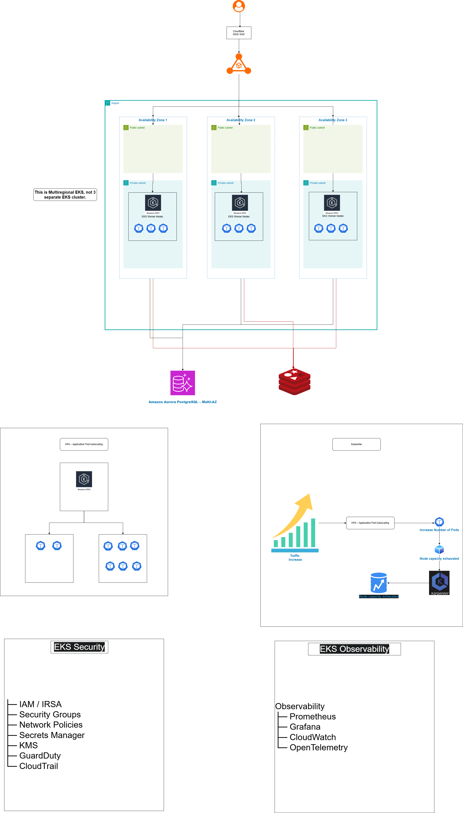

# Redemption Assessment

This project implements a production-oriented reference architecture AWS EKS platform for the Redemption microservice, designed to support high availability, 
horizontal scaling, secure service exposure, and resilience during flash-sale traffic spikes. 
The solution provisions the infrastructure using Terraform, deploys the workload using Kubernetes manifests, and validates scalability using k6 load testing.

------------------------------------------------------------
| Area               | Implementation                      |
| ------------------ | ----------------------------------- |
| Compute            | Amazon EKS                          |
| Networking         | VPC across 3 AZs                    |
| Ingress            | AWS Load Balancer Controller + ALB  |
| Database           | Aurora PostgreSQL                   |
| Cache              | ElastiCache Redis                   |
| Container Registry | Amazon ECR                          |
| Autoscaling        | Kubernetes HPA                      |
| Availability       | Multi-AZ + PDB                      |
| Security           | IRSA, KMS, GuardDuty, NetworkPolicy |
| Testing            | k6                                  |
------------------------------------------------------------

## Architecture


```text
Internet
   ↓
ALB
   ↓
Kubernetes Ingress
   ↓
ClusterIP Service
   ↓
Redemption Pods
   ↓
Aurora PostgreSQL
   +
ElastiCache Redis
```
## Architecture Decisions

### Three Availability Zones

EKS worker nodes and supporting infrastructure are distributed across three Availability Zones to reduce the impact of an AZ-level failure.

### Private application subnets

Worker nodes are deployed in private subnets so application workloads are not directly exposed to the Internet.

### ALB

The AWS Load Balancer Controller provisions an Application Load Balancer from the Kubernetes Ingress, providing external HTTP routing without exposing the application pods directly.

### Aurora

Aurora PostgreSQL provides a managed relational datastore with Multi-AZ resilience.

### Redis

ElastiCache Redis is used as a low-latency caching layer and supports Multi-AZ failover.


## Current Status
## Implementation Status

| Area                          | Status                              |
|-------------------------------|------------------------------------ |
| Terraform AWS infrastructure  | ✅ Implemented                     |
| EKS cluster                   | ✅ Implemented                     |
| Multi-AZ networking           | ✅ Implemented                     |
| AWS Load Balancer Controller  | ✅ Implemented                     |
| Kubernetes deployment         | ✅ Implemented                     |
| HPA                           | ✅ Implemented                     |
| PDB                           | ✅ Implemented                     |
| NetworkPolicy                 | ✅ Implemented                     |
| k6 load testing               | ✅ Implemented                     |
| HTTPS                         | ⚠️ Production hardening required   |
| Production application image  | ⚠️ Replace test image              |
| Prometheus/Grafana            | 🔄 Future enhancement              |
| Karpenter                     | 🔄 Future enhancement              |

### Horizontal Pod Autoscaler

The HPA scales the Redemption workload horizontally based on CPU
utilization.
```text
Traffic increase:
    ↓
CPU utilization increases
    ↓
HPA increases desired replicas
    ↓
New pods are scheduled
    ↓
ALB distributes traffic across healthy pods
```
```text
| Parameter        | Value |
| ---------------- | ----: |
| Minimum replicas |     3 |
| Maximum replicas |    30 |
| CPU target       |   60% |
```


## Repository Layout

```text
redemption-assessment/
├── docker/
├── terraform/
├── kubernetes/
├── tests/
├── docs/
└── README.md
```

## Terraform Scope

The Terraform code provisions:

- VPC with public, private, and data subnets across three Availability Zones
- Amazon EKS with IRSA enabled and a baseline managed node group
- AWS Load Balancer Controller installed with Terraform so Kubernetes Ingress creates an ALB
- Amazon Aurora PostgreSQL with Multi-AZ resilience
- Amazon ElastiCache for Redis with Multi-AZ failover
- Amazon ECR for storing the workload image
- KMS, CloudTrail, GuardDuty, and a CloudWatch log group for security and auditability

## Kubernetes Scope

The Kubernetes manifests provide:

- Namespace isolation
- A test Deployment using `nginx:alpine` with health checks and spread constraints
- ClusterIP Service
- AWS ALB-backed Ingress
- The ALB is provisioned automatically by the AWS Load Balancer Controller
- HPA for pod autoscaling
- PDB for safer rollouts and node disruptions
- NetworkPolicy for default-deny style east-west control

```text
---------------------------------------------------------------------
| Component     | Purpose                                           |
| ------------- | ------------------------------------------------- |
| Deployment    | Runs and manages Redemption pods                  |
| Service       | Provides stable internal service discovery        |
| Ingress       | Exposes the service through AWS ALB               |
| HPA           | Scales pods based on resource utilization         |
| PDB           | Maintains minimum availability during disruptions |
| NetworkPolicy | Restricts unwanted pod-to-pod traffic             |
| Probes        | Prevent unhealthy pods from receiving traffic     |
---------------------------------------------------------------------
```
## Load Testing

The application was tested using k6 to validate response latency,
HTTP error rate, and behavior under increasing concurrent traffic.

### Load Profile
```text
| Stage | Duration | Target VUs |
|---|---:|---:|
| Warm-up | 2 min | 20 |
| Ramp-up | 3 min | 100 |
| Ramp-up | 2 min | 200 |
| Sustained load | 5 min | 200 |
| Ramp-down | 2 min | 20 |
| Cool-down | 2 min | 0 |
```

### Acceptance Criteria

```text
| Metric | Threshold |
|---|---:|
| HTTP request failure rate | < 1% |
| P95 response time | < 500 ms |
| P99 response time | < 1 sec |
```

The test intentionally maintains 200 concurrent virtual users for
5 minutes to evaluate sustained application behavior before
ramping down.


## How To Use

1. Review and update variables in `terraform/variables.tf`.
2. Create a `terraform.tfvars` file inside `terraform/` with environment-specific values.
3. Configure AWS credentials before running Terraform.
4. Run Terraform from the `terraform/` directory.
5. Optionally set `aws_profile` in `terraform.tfvars`, or export `AWS_PROFILE`, if you use a named AWS CLI profile.
6. Apply the manifests from the `kubernetes/` directory after the cluster is ready.
7. Run the k6 test in `tests/load-test.js` against the deployed ingress endpoint.

### Clone Repository
```bash 
git clone <your-github-repository-url>
cd redemption-cloud-engineer-assessment
```
## Prerequisites

The following tools are required:

- AWS CLI
- Terraform
- kubectl
- Docker
- k6
- An AWS account with permissions to provision the required resources

```bash 
terraform version
aws --version
kubectl version --client
k6 version
```

### Configure Terraform
```bash 
cd terraform
terraform init
terraform plan
terraform apply
```

### Configure kubectl
```bash 
aws eks update-kubeconfig \
  --region <region> \
  --name <cluster-name>
```

### Deploy application
```bash 
kubectl apply -f ../kubernetes/
```

### Verify
```bash 
kubectl get nodes
kubectl get pods -n redemption
kubectl get svc -n redemption
kubectl get ingress -n redemption
kubectl get hpa -n redemption
```

### Run load test
BASE_URL=https://<your-domain> k6 run tests/load-test.js

## Test Observations

During the sustained 200-VU load:

- The application remained available.
- HPA did not increase the number of application replicas as resource
  utilization increased, as CPU stayed in the range of 5% rather than target 60%
- Requests continued to be routed only to healthy pods.


## AWS Credentials

Terraform needs valid AWS credentials for both the S3 backend and the AWS provider.

- With AWS CLI default profile: run `aws configure`
- With a named profile: run `aws configure --profile accor`
- Then either set `aws_profile = "accor"` in `terraform.tfvars` or set `AWS_PROFILE=accor` before running Terraform
- If you use environment variables instead, set `AWS_ACCESS_KEY_ID`, `AWS_SECRET_ACCESS_KEY`, and `AWS_REGION`

## Notes

- The ingress manifest contains placeholder values for host, certificate ARN, and security group IDs.
- The Ingress is configured for a public HTTP ALB so it can provision immediately; add HTTPS later if needed.
- The deployment currently uses `nginx:alpine` as a test image; switch it to the ECR URL output once you push your real application image.
- The default Terraform sizing is reduced for assessment and test use: EKS nodes default to `t3.small` and Redis defaults to `cache.t4g.micro`.
- Aurora uses a non-prod default password that already satisfies the guard rails; override it before any real deployment.
- Replace open CIDR ranges with Cloudflare IP ranges or your approved ingress ranges before production use.
- Karpenter, Prometheus, Grafana, and OpenTelemetry are represented in the design but would typically be installed after cluster creation using Helm or GitOps.

# Task Assignment — 3 Engineers
the Senior should own architecture, technical decisions, integration and review, while the Juniors own well-defined implementation work.

| Engineer              | Responsibility                | Key Tasks                                                                                 |
| --------------------- | ----------------------------- | ----------------------------------------------------------------------------------------- |
| **Senior Engineer**   | Architecture & Technical Lead | Architecture, AWS design, EKS design, security, integration, code review, troubleshooting |
| **Junior Engineer 1** | Infrastructure                | Terraform, VPC, EKS, ECR, Aurora, Redis, IAM                                              |
| **Junior Engineer 2** | Kubernetes & Testing          | Docker, Kubernetes manifests, HPA, PDB, NetworkPolicy, ALB, k6 testing                    |

## Minimize operational toil through ownership
The team should avoid creating operational dependencies on a specific engineer.


## Day 2 Operations

### Application Failure


### Automation and Self-Healing

### Monitoring and Alerting
```text
Alert
 ↓
Check dashboard
 ↓
Check pod health/restarts
 ↓
Check application logs
 ↓
Check recent deployment
 ↓
Rollback if deployment-related
 ↓
Verify recovery
```
### Standardized Operations

### Failure Handling
```text
Alert
 ↓
Check EKS/node health
 ↓
Check AWS infrastructure
 ↓
Kubernetes reschedules workloads
 ↓
Verify service availability
 ↓
Escalate if required
```